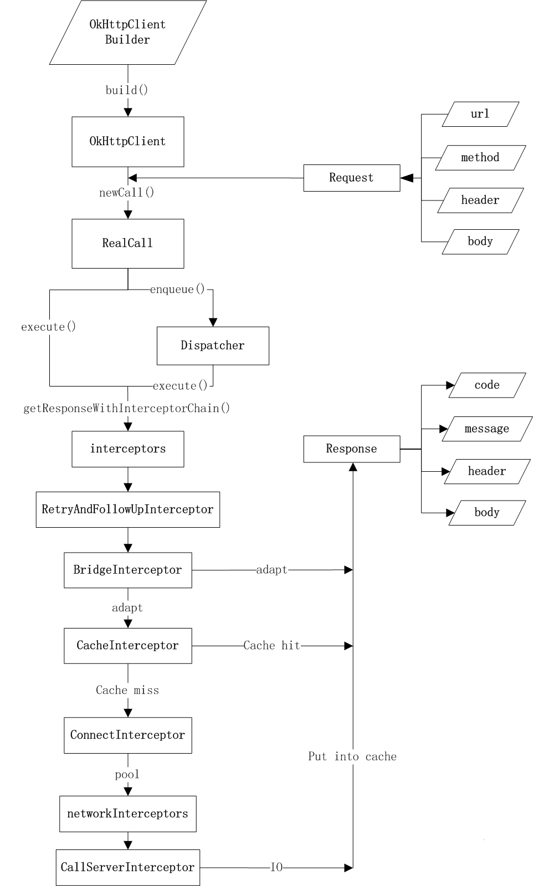
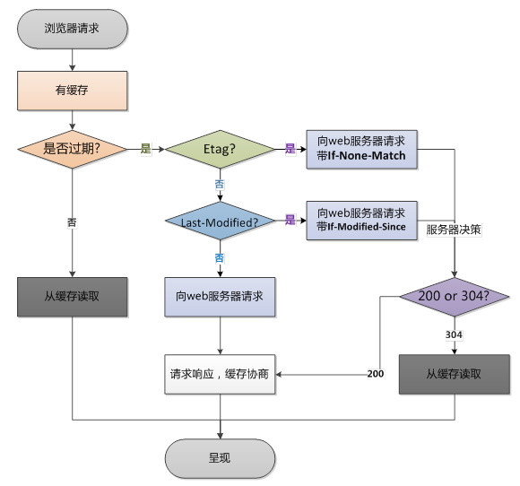

#okhttp

##官方描述
Http是现在网络传输常用的协议去传输数据。有效的使用HTTP会更加快的反应和节省带宽。

* 支持http2，对一个host的所有请求共享同一个socket
* 如果不支持HTTP/2 会使用连接池，支持连接复用，减少延迟
* 支持透明的gzip压缩响应体
* 通过缓存减少网络的重复请求
* 请求失败时自动重试主机的其他ip，自动重定向
* Using OkHttp is easy. Its request/response API is designed with fluent builders and immutability.

##基本使用
###GET
```
OkHttpClient client = new OkHttpClient();

String run(String url) throws IOException {
  Request request = new Request.Builder()
      .url(url)
      .build();

  Response response = client.newCall(request).execute();
  return response.body().string();
}
```

###POST
```
public static final MediaType JSON
    = MediaType.parse("application/json; charset=utf-8");

OkHttpClient client = new OkHttpClient();

String post(String url, String json) throws IOException {
  RequestBody body = RequestBody.create(JSON, json);
  Request request = new Request.Builder()
      .url(url)
      .post(body)
      .build();
  Response response = client.newCall(request).execute();
  return response.body().string();
}
```

##基本思路


###工作流程
当我们用`OkHttpClient.newCall(request)`进行`execute/enqueue`时，实际是将请求`Call`放到了`Dispatcher`中，okhttp使用Dispatcher进行线程分发，它有两种方法，一个是普通的同步单线程；另一种是使用了队列进行并发任务的分发(Dispatch)与回调，我们下面主要分析第二种，也就是队列这种情况。

###Dispatcher的结构
Dispatcher维护了如下变量，用于控制并发的请求。

* maxRequests = 64: 最大并发请求数为64
* maxRequestsPerHost = 5: 每个主机最大请求数为5
* Dispatcher: 分发者，也就是生产者（默认在主线程）
* AsyncCall: 队列中需要处理的Runnable（包装了异步回调接口）
* ExecutorService：消费者池（也就是线程池）
* Deque<readyAsyncCalls>：缓存（用数组实现，可自动扩容，无大小限制）
* Deque<runningAsyncCalls>：正在运行的任务，仅仅是用来引用正在运行的任务以判断并发量，注意它并不是消费者缓存

根据生产者消费者模型的模型理论，当入队(enqueue)请求时，如果满足(runningRequests<64 && runningRequestsPerHost<5)，那么就直接把AsyncCall直接加到runningCalls的队列中，并在线程池中执行。如果消费者缓存满了，就放入readyAsyncCalls进行缓存等待。


```
  private void promoteCalls() {
    if (runningAsyncCalls.size() >= maxRequests) return; // Already running max capacity.
    if (readyAsyncCalls.isEmpty()) return; // No ready calls to promote.

    for (Iterator<AsyncCall> i = readyAsyncCalls.iterator(); i.hasNext(); ) {
      AsyncCall call = i.next();

      if (runningCallsForHost(call) < maxRequestsPerHost) {
        i.remove();
        runningAsyncCalls.add(call);
        executorService().execute(call);
      }

      if (runningAsyncCalls.size() >= maxRequests) return; // Reached max capacity.
    }
  }
```
当任务执行完成后,调用finished的promoteCalls()函数，手动移动缓存区（可以看出这里是主动清理的，因此不会发生死锁）。

好的，在回到RealCall中，我们看到无论是execute还是enqueue，真正的Response是通过这个函数getResponseWithInterceptorChain获取的，其他的代码都是用作控制与回调。而这里就是真正请求的入口，也是到了OkHttp的一个很精彩的设计:`Interceptor与Chain`

###拦截器与调用链

```
private Response getResponseWithInterceptorChain() throws IOException {
  // Build a full stack of interceptors.
  List<Interceptor> interceptors = new ArrayList<>();
  interceptors.addAll(client.interceptors());
  interceptors.add(retryAndFollowUpInterceptor);
  interceptors.add(new BridgeInterceptor(client.cookieJar()));
  interceptors.add(new CacheInterceptor(client.internalCache()));
  interceptors.add(new ConnectInterceptor(client));
  if (!retryAndFollowUpInterceptor.isForWebSocket()) {
   interceptors.addAll(client.networkInterceptors());
  }
  interceptors.add(new CallServerInterceptor(
     retryAndFollowUpInterceptor.isForWebSocket()));

  Interceptor.Chain chain = new RealInterceptorChain(
     interceptors, null, null, null, 0, originalRequest);
  return chain.proceed(originalRequest);
}
```

RealInterceptorChain会递归的创建并以此调用拦截器，去掉诸多异常，简化版代码如下:

```
public Response proceed(Request request, StreamAllocation streamAllocation, HttpStream httpStream,
    Connection connection) throws IOException {
  if (index >= interceptors.size()) throw new AssertionError();

  // Call the next interceptor in the chain.
  RealInterceptorChain next = new RealInterceptorChain(
      interceptors, streamAllocation, httpStream, connection, index + 1, request);
  Interceptor interceptor = interceptors.get(index);

  Response response = interceptor.intercept(next);

  return response;
}
```

	
* 在配置`OkHttpClient`时设置的`interceptors`
* 负责失败重试以及重定向的`ReteryAndFollowUpInterceptor`
* 负责把用户构造的请求转换为发送到服务器的请求，把服务器返回的响应转换为用户友好的响应的`BridgeInteceptor`
* 负责读取缓存直接返回，更新缓存的`CacheInterceptor`
* 负责和服务器建立连接的`ConnectInterceptor`
* 配置`OkHttpClient`时设置的`networkInterceptors`
* 负责向服务器发送请求数据，从服务器读取响应数据的`CallServerInterceptor`。

责任链模式在这个 Interceptor 链条中得到了很好的实践。


####RetryAndFollowUpInterceptor

```
/**
 * This interceptor recovers from failures and follows redirects as necessary. It may throw an
 * {@link IOException} if the call was canceled.
 */
public final class RetryAndFollowUpInterceptor implements Interceptor {
  /**
   * How many redirects and auth challenges should we attempt? Chrome follows 21 redirects; Firefox,
   * curl, and wget follow 20; Safari follows 16; and HTTP/1.0 recommends 5.
   */
  private static final int MAX_FOLLOW_UPS = 20;

  private final OkHttpClient client;
  private StreamAllocation streamAllocation;
  private boolean forWebSocket;
  private volatile boolean canceled;

  public RetryAndFollowUpInterceptor(OkHttpClient client) {
    this.client = client;
  }

......

  @Override public Response intercept(Chain chain) throws IOException {
    Request request = chain.request();

    streamAllocation = new StreamAllocation(
        client.connectionPool(), createAddress(request.url()));

    int followUpCount = 0;
    Response priorResponse = null;
    while (true) {
      if (canceled) {
        streamAllocation.release();
        throw new IOException("Canceled");
      }

      Response response = null;
      boolean releaseConnection = true;
      try {
        response = ((RealInterceptorChain) chain).proceed(request, streamAllocation, null, null);
        releaseConnection = false;
      } catch (RouteException e) {
        // The attempt to connect via a route failed. The request will not have been sent.
        if (!recover(e.getLastConnectException(), true, request)) throw e.getLastConnectException();
        releaseConnection = false;
        continue;
      } catch (IOException e) {
        // An attempt to communicate with a server failed. The request may have been sent.
        if (!recover(e, false, request)) throw e;
        releaseConnection = false;
        continue;
      } finally {
        // We're throwing an unchecked exception. Release any resources.
        if (releaseConnection) {
          streamAllocation.streamFailed(null);
          streamAllocation.release();
        }
      }

      // Attach the prior response if it exists. Such responses never have a body.
      if (priorResponse != null) {
        response = response.newBuilder()
            .priorResponse(priorResponse.newBuilder()
                .body(null)
                .build())
            .build();
      }

      Request followUp = followUpRequest(response);

      if (followUp == null) {
        if (!forWebSocket) {
          streamAllocation.release();
        }
        return response;
      }

      closeQuietly(response.body());

      if (++followUpCount > MAX_FOLLOW_UPS) {
        streamAllocation.release();
        throw new ProtocolException("Too many follow-up requests: " + followUpCount);
      }

      if (followUp.body() instanceof UnrepeatableRequestBody) {
        throw new HttpRetryException("Cannot retry streamed HTTP body", response.code());
      }

      if (!sameConnection(response, followUp.url())) {
        streamAllocation.release();
        streamAllocation = new StreamAllocation(
            client.connectionPool(), createAddress(followUp.url()));
      } else if (streamAllocation.stream() != null) {
        throw new IllegalStateException("Closing the body of " + response
            + " didn't close its backing stream. Bad interceptor?");
      }

      request = followUp;
      priorResponse = response;
    }
  }

  private Address createAddress(HttpUrl url) {
    SSLSocketFactory sslSocketFactory = null;
    HostnameVerifier hostnameVerifier = null;
    CertificatePinner certificatePinner = null;
    if (url.isHttps()) {
      sslSocketFactory = client.sslSocketFactory();
      hostnameVerifier = client.hostnameVerifier();
      certificatePinner = client.certificatePinner();
    }

    return new Address(url.host(), url.port(), client.dns(), client.socketFactory(),
        sslSocketFactory, hostnameVerifier, certificatePinner, client.proxyAuthenticator(),
        client.proxy(), client.protocols(), client.connectionSpecs(), client.proxySelector());
  }
```

`RetryAndFollowUpInterceptor`在`intercept()`中首先从client取得connection pool,用所请求的URL创建StreamAllocation对象。

Address描述某一个特定的服务器地址。StreamAllocation对象则用于分配一个到特定的服务器地址的流HttpStream，这个HttpStream可能是从connection pool中取得的之前没有释放的连接，也可能是重新分配的。RetryAndFollowUpInterceptor这里算是为后面的操作准备执行条件StreamAllocation。

随后`RetryAndFollowUpInterceptor.intercept()`利用Interceptor链中后面的Interceptor来获取网络响应。并检查是否为重定向响应。若不是就将响应返回，若是则做进一步处理。

对于重定向的响应，`RetryAndFollowUpInterceptor.intercept()`会利用响应的信息创建一个新的请求。并检查新请求的服务器地址与老地址是否相同，若是不相同则会根据新的地址创建Address对象及StreamAllocation对象。

`RetryAndFollowUpInterceptor`对重定向的响应也不会无休止的处理下去，它处理的最多的重定向级数为20次，超过20次时，它会抛出异常出来。

RetryAndFollowUpInterceptor通过followUpRequest()从响应的信息中提取出重定向的信息，并构造新的网络请求：

```
  /**
   * Figures out the HTTP request to make in response to receiving {@code userResponse}. This will
   * either add authentication headers, follow redirects or handle a client request timeout. If a
   * follow-up is either unnecessary or not applicable, this returns null.
   */
  private Request followUpRequest(Response userResponse) throws IOException {
    if (userResponse == null) throw new IllegalStateException();
    Connection connection = streamAllocation.connection();
    Route route = connection != null
        ? connection.route()
        : null;
    int responseCode = userResponse.code();

    final String method = userResponse.request().method();
    switch (responseCode) {
      case HTTP_PROXY_AUTH:
        Proxy selectedProxy = route != null
            ? route.proxy()
            : client.proxy();
        if (selectedProxy.type() != Proxy.Type.HTTP) {
          throw new ProtocolException("Received HTTP_PROXY_AUTH (407) code while not using proxy");
        }
        return client.proxyAuthenticator().authenticate(route, userResponse);

      case HTTP_UNAUTHORIZED:
        return client.authenticator().authenticate(route, userResponse);

      case HTTP_PERM_REDIRECT:
      case HTTP_TEMP_REDIRECT:
        // "If the 307 or 308 status code is received in response to a request other than GET
        // or HEAD, the user agent MUST NOT automatically redirect the request"
        if (!method.equals("GET") && !method.equals("HEAD")) {
          return null;
        }
        // fall-through
      case HTTP_MULT_CHOICE:
      case HTTP_MOVED_PERM:
      case HTTP_MOVED_TEMP:
      case HTTP_SEE_OTHER:
        // Does the client allow redirects?
        if (!client.followRedirects()) return null;

        String location = userResponse.header("Location");
        if (location == null) return null;
        HttpUrl url = userResponse.request().url().resolve(location);

        // Don't follow redirects to unsupported protocols.
        if (url == null) return null;

        // If configured, don't follow redirects between SSL and non-SSL.
        boolean sameScheme = url.scheme().equals(userResponse.request().url().scheme());
        if (!sameScheme && !client.followSslRedirects()) return null;

        // Redirects don't include a request body.
        Request.Builder requestBuilder = userResponse.request().newBuilder();
        if (HttpMethod.permitsRequestBody(method)) {
          if (HttpMethod.redirectsToGet(method)) {
            requestBuilder.method("GET", null);
          } else {
            requestBuilder.method(method, null);
          }
          requestBuilder.removeHeader("Transfer-Encoding");
          requestBuilder.removeHeader("Content-Length");
          requestBuilder.removeHeader("Content-Type");
        }

        // When redirecting across hosts, drop all authentication headers. This
        // is potentially annoying to the application layer since they have no
        // way to retain them.
        if (!sameConnection(userResponse, url)) {
          requestBuilder.removeHeader("Authorization");
        }

        return requestBuilder.url(url).build();

      case HTTP_CLIENT_TIMEOUT:
        // 408's are rare in practice, but some servers like HAProxy use this response code. The
        // spec says that we may repeat the request without modifications. Modern browsers also
        // repeat the request (even non-idempotent ones.)
        if (userResponse.request().body() instanceof UnrepeatableRequestBody) {
          return null;
        }

        return userResponse.request();

      default:
        return null;
    }
  }
```

* HTTP_PROXY_AUTH 407 表示需要经过代理服务器认证 ，这时抛出异常，不进行重定向。
* HTTP_UNAUTHORIZED 401 身份未认证。
* HTTP_PERM_REDIRECT 308 HTTP_TEMP_REDIRECT 307 这两种状态码时，只有当请求的method不为GET和HEAD时不进行重定向，否则按照下边一列状态码的方式处理。
* HTTP_MULT_CHOICE 300 HTTP_MOVED_PERM 301 HTTP_MOVED_TEMP 302 HTTP_SEE_OTHER 303 当是这些状态码时，先判断是否运行重定向，然后获得Response中的Location首部的值，然后用HttpUrl去解析，如果是host不同，那么去掉所有的认证首部，这是为了安全。

我们知道OkHttp提供了非常好用的容错功能，它可以从某些类型的网络错误中恢复，即出错重试机制。这种出错重试机制主要由recover()来实现：

```
  /**
   * Report and attempt to recover from a failure to communicate with a server. Returns true if
   * {@code e} is recoverable, or false if the failure is permanent. Requests with a body can only
   * be recovered if the body is buffered.
   */
  private boolean recover(IOException e, boolean routeException, Request userRequest) {
    streamAllocation.streamFailed(e);

    // The application layer has forbidden retries.
    if (!client.retryOnConnectionFailure()) return false;

    // We can't send the request body again.
    if (!routeException && userRequest.body() instanceof UnrepeatableRequestBody) return false;

    // This exception is fatal.
    if (!isRecoverable(e, routeException)) return false;

    // No more routes to attempt.
    if (!streamAllocation.hasMoreRoutes()) return false;

    // For failure recovery, use the same route selector with a new connection.
    return true;
  }

  private boolean isRecoverable(IOException e, boolean routeException) {
    // If there was a protocol problem, don't recover.
    if (e instanceof ProtocolException) {
      return false;
    }

    // If there was an interruption don't recover, but if there was a timeout connecting to a route
    // we should try the next route (if there is one).
    if (e instanceof InterruptedIOException) {
      return e instanceof SocketTimeoutException && routeException;
    }

    // Look for known client-side or negotiation errors that are unlikely to be fixed by trying
    // again with a different route.
    if (e instanceof SSLHandshakeException) {
      // If the problem was a CertificateException from the X509TrustManager,
      // do not retry.
      if (e.getCause() instanceof CertificateException) {
        return false;
      }
    }
    if (e instanceof SSLPeerUnverifiedException) {
      // e.g. a certificate pinning error.
      return false;
    }

    // An example of one we might want to retry with a different route is a problem connecting to a
    // proxy and would manifest as a standard IOException. Unless it is one we know we should not
    // retry, we return true and try a new route.
    return true;
  }
  
```
主要是对某些类型IOException的恢复，恢复的次数会由StreamAllocation控制。

总结一下RetryAndFollowUpInterceptor做的事情：

1. 创建StreamAllocation对象，为后面流程的执行准备条件。
2. 处理重定向的HTTP响应。
3. 错误恢复。

####BridgeInterceptor

```
package okhttp3.internal.http;

import java.io.IOException;
import java.util.List;
import okhttp3.Cookie;
import okhttp3.CookieJar;
import okhttp3.Headers;
import okhttp3.Interceptor;
import okhttp3.MediaType;
import okhttp3.Request;
import okhttp3.RequestBody;
import okhttp3.Response;
import okhttp3.internal.Version;
import okio.GzipSource;
import okio.Okio;

import static okhttp3.internal.Util.hostHeader;

/**
 * Bridges from application code to network code. First it builds a network request from a user
 * request. Then it proceeds to call the network. Finally it builds a user response from the network
 * response.
 */
public final class BridgeInterceptor implements Interceptor {
  private final CookieJar cookieJar;

  public BridgeInterceptor(CookieJar cookieJar) {
    this.cookieJar = cookieJar;
  }

  @Override public Response intercept(Chain chain) throws IOException {
    Request userRequest = chain.request();
    Request.Builder requestBuilder = userRequest.newBuilder();

    RequestBody body = userRequest.body();
    if (body != null) {
      MediaType contentType = body.contentType();
      if (contentType != null) {
        requestBuilder.header("Content-Type", contentType.toString());
      }

      long contentLength = body.contentLength();
      if (contentLength != -1) {
        requestBuilder.header("Content-Length", Long.toString(contentLength));
        requestBuilder.removeHeader("Transfer-Encoding");
      } else {
        requestBuilder.header("Transfer-Encoding", "chunked");
        requestBuilder.removeHeader("Content-Length");
      }
    }

    if (userRequest.header("Host") == null) {
      requestBuilder.header("Host", hostHeader(userRequest.url(), false));
    }

    if (userRequest.header("Connection") == null) {
      requestBuilder.header("Connection", "Keep-Alive");
    }

    // If we add an "Accept-Encoding: gzip" header field we're responsible for also decompressing
    // the transfer stream.
    boolean transparentGzip = false;
    if (userRequest.header("Accept-Encoding") == null) {
      transparentGzip = true;
      requestBuilder.header("Accept-Encoding", "gzip");
    }

    List<Cookie> cookies = cookieJar.loadForRequest(userRequest.url());
    if (!cookies.isEmpty()) {
      requestBuilder.header("Cookie", cookieHeader(cookies));
    }

    if (userRequest.header("User-Agent") == null) {
      requestBuilder.header("User-Agent", Version.userAgent());
    }

    Response networkResponse = chain.proceed(requestBuilder.build());

    HttpHeaders.receiveHeaders(cookieJar, userRequest.url(), networkResponse.headers());

    Response.Builder responseBuilder = networkResponse.newBuilder()
        .request(userRequest);

    if (transparentGzip
        && "gzip".equalsIgnoreCase(networkResponse.header("Content-Encoding"))
        && HttpHeaders.hasBody(networkResponse)) {
      GzipSource responseBody = new GzipSource(networkResponse.body().source());
      Headers strippedHeaders = networkResponse.headers().newBuilder()
          .removeAll("Content-Encoding")
          .removeAll("Content-Length")
          .build();
      responseBuilder.headers(strippedHeaders);
      responseBuilder.body(new RealResponseBody(strippedHeaders, Okio.buffer(responseBody)));
    }

    return responseBuilder.build();
  }

  /** Returns a 'Cookie' HTTP request header with all cookies, like {@code a=b; c=d}. */
  private String cookieHeader(List<Cookie> cookies) {
    StringBuilder cookieHeader = new StringBuilder();
    for (int i = 0, size = cookies.size(); i < size; i++) {
      if (i > 0) {
        cookieHeader.append("; ");
      }
      Cookie cookie = cookies.get(i);
      cookieHeader.append(cookie.name()).append('=').append(cookie.value());
    }
    return cookieHeader.toString();
  }
}
```
这个Interceptor做的事情比较简单。可以分为发送请求和收到响应两个阶段来看。在发送请求阶段，`BridgeInterceptor`补全一些`http header`,这主要包括`Content-Type`，`Content-Length`， `Transfer-Encoding`， `Host`, `Connection`， `Accept-Encoding`, `User-Agent` ，还加载`Cookie`，随后创建新的Request，并交给后续的Interceptor处理，以获取响应。

而在从后续的Interceptor获取响应之后，会首先保存Cookie。如果服务器返回的响应的content是以gzip压缩过的，则会先进行解压缩，移除响应中的header Content-Encoding和Content-Length，构造新的响应并返回；否则直接返回响应。

CookieJar来自于OkHttpClient，它是OkHttp的Cookie管理器，负责Cookie的存取：

```
package okhttp3;

import java.util.Collections;
import java.util.List;

/**
 * Provides <strong>policy</strong> and <strong>persistence</strong> for HTTP cookies.
 *
 * <p>As policy, implementations of this interface are responsible for selecting which cookies to
 * accept and which to reject. A reasonable policy is to reject all cookies, though that may be
 * interfere with session-based authentication schemes that require cookies.
 *
 * <p>As persistence, implementations of this interface must also provide storage of cookies. Simple
 * implementations may store cookies in memory; sophisticated ones may use the file system or
 * database to hold accepted cookies. The <a
 * href="https://tools.ietf.org/html/rfc6265#section-5.3">cookie storage model</a> specifies
 * policies for updating and expiring cookies.
 */
public interface CookieJar {
  /** A cookie jar that never accepts any cookies. */
  CookieJar NO_COOKIES = new CookieJar() {
    @Override public void saveFromResponse(HttpUrl url, List<Cookie> cookies) {
    }

    @Override public List<Cookie> loadForRequest(HttpUrl url) {
      return Collections.emptyList();
    }
  };

  /**
   * Saves {@code cookies} from an HTTP response to this store according to this jar's policy.
   *
   * <p>Note that this method may be called a second time for a single HTTP response if the response
   * includes a trailer. For this obscure HTTP feature, {@code cookies} contains only the trailer's
   * cookies.
   */
  void saveFromResponse(HttpUrl url, List<Cookie> cookies);

  /**
   * Load cookies from the jar for an HTTP request to {@code url}. This method returns a possibly
   * empty list of cookies for the network request.
   *
   * <p>Simple implementations will return the accepted cookies that have not yet expired and that
   * {@linkplain Cookie#matches match} {@code url}.
   */
  List<Cookie> loadForRequest(HttpUrl url);
}
```
由`OkHttpClient`默认的构造过程可以看到，OkHttp默认是没有提供Cookie管理功能的。由这里的代码，我们大概也能知道支持Cookie的话，需要做些什么事情。

由OkHttpClient默认的构造过程可以看到，OkHttp中默认是没有提供Cookie管理功能的。由这里的代码，我们大概也能知道要支持Cookie的话，需要做些什么事情。

####CacheInterceptor

CacheInterceptor紧接于BridgeInterceptor之后，它主要用来处理缓存：

```
public final class CacheInterceptor implements Interceptor {
  private static final ResponseBody EMPTY_BODY = new ResponseBody() {
    @Override public MediaType contentType() {
      return null;
    }

    @Override public long contentLength() {
      return 0;
    }

    @Override public BufferedSource source() {
      return new Buffer();
    }
  };

  final InternalCache cache;

  public CacheInterceptor(InternalCache cache) {
    this.cache = cache;
  }

  @Override public Response intercept(Chain chain) throws IOException {
    Response cacheCandidate = cache != null
        ? cache.get(chain.request())
        : null;

    long now = System.currentTimeMillis();

    CacheStrategy strategy = new CacheStrategy.Factory(now, chain.request(), cacheCandidate).get();
    Request networkRequest = strategy.networkRequest;
    Response cacheResponse = strategy.cacheResponse;

    if (cache != null) {
      cache.trackResponse(strategy);
    }

    if (cacheCandidate != null && cacheResponse == null) {
      closeQuietly(cacheCandidate.body()); // The cache candidate wasn't applicable. Close it.
    }

    // If we're forbidden from using the network and the cache is insufficient, fail.
    if (networkRequest == null && cacheResponse == null) {
      return new Response.Builder()
          .request(chain.request())
          .protocol(Protocol.HTTP_1_1)
          .code(504)
          .message("Unsatisfiable Request (only-if-cached)")
          .body(EMPTY_BODY)
          .sentRequestAtMillis(-1L)
          .receivedResponseAtMillis(System.currentTimeMillis())
          .build();
    }

    // If we don't need the network, we're done.
    if (networkRequest == null) {
      return cacheResponse.newBuilder()
          .cacheResponse(stripBody(cacheResponse))
          .build();
    }

    Response networkResponse = null;
    try {
      networkResponse = chain.proceed(networkRequest);
    } finally {
      // If we're crashing on I/O or otherwise, don't leak the cache body.
      if (networkResponse == null && cacheCandidate != null) {
        closeQuietly(cacheCandidate.body());
      }
    }

    // If we have a cache response too, then we're doing a conditional get.
    if (cacheResponse != null) {
      if (validate(cacheResponse, networkResponse)) {
        Response response = cacheResponse.newBuilder()
            .headers(combine(cacheResponse.headers(), networkResponse.headers()))
            .cacheResponse(stripBody(cacheResponse))
            .networkResponse(stripBody(networkResponse))
            .build();
        networkResponse.body().close();

        // Update the cache after combining headers but before stripping the
        // Content-Encoding header (as performed by initContentStream()).
        cache.trackConditionalCacheHit();
        cache.update(cacheResponse, response);
        return response;
      } else {
        closeQuietly(cacheResponse.body());
      }
    }

    Response response = networkResponse.newBuilder()
        .cacheResponse(stripBody(cacheResponse))
        .networkResponse(stripBody(networkResponse))
        .build();

    if (HttpHeaders.hasBody(response)) {
      CacheRequest cacheRequest = maybeCache(response, networkResponse.request(), cache);
      response = cacheWritingResponse(cacheRequest, response);
    }

    return response;
  }
```

对于CacheInterceptor.intercept(Chain chain)的分析同样可以分为两个阶段，即请求发送阶段和响应获取之后的阶段。这两个阶段由chain.proceed(networkRequest)来分割。

在请求发送阶段，主要是尝试从`cache`中获取响应，获取成功的话，且响应可用未过期，则响应会被肢解返回；否则通过后续的Interceptor来从网络获取，获取到响应之后，若需要缓存的，则缓存起来。

由RealCall.getResponseWithInterceptorChain()可见CacheInterceptor的cache同样来自于OkHttpClient。OkHttp已经有实现Cache的整套策略，在Cache类，但默认情况下不会被用起来，需要自己在创建OkHttpClient时，手动创建并传给OkHttpClient.Builder。


####OkHttp缓存策略

OkHttp用CacheStrategy很好的实现了符合HTTP规范的HTTP缓存策略；



CacheStrategy()构造

* networkRequest：网络请求；
* cacheResponse：缓存响应；

```
 /** The request to send on the network, or null if this call doesn't use the network. */
  public final Request networkRequest;

  /** The cached response to return or validate; or null if this call doesn't use a cache. */
  public final Response cacheResponse;

  private CacheStrategy(Request networkRequest, Response cacheResponse) {
    this.networkRequest = networkRequest;
    this.cacheResponse = cacheResponse;
  }
```

isCacheable()：根据返回的状态码，主要用来判断一个Reponse是否可以缓存；如果不能缓存，那么Request就需要走网络请求；不支持缓存部分内容；如果是302响应(暂时性重定向，需要进一步判断？)；如果有Reponse和Request都有noStore()，那么代表不能缓存；

```
/** Returns true if {@code response} can be stored to later serve another request. */
  public static boolean isCacheable(Response response, Request request) {
    // Always go to network for uncacheable response codes (RFC 7231 section 6.1),
    // This implementation doesn't support caching partial content.
    switch (response.code()) {
      case HTTP_OK:
      case HTTP_NOT_AUTHORITATIVE:
      case HTTP_NO_CONTENT:
      case HTTP_MULT_CHOICE:
      case HTTP_MOVED_PERM:
      case HTTP_NOT_FOUND:
      case HTTP_BAD_METHOD:
      case HTTP_GONE:
      case HTTP_REQ_TOO_LONG:
      case HTTP_NOT_IMPLEMENTED:
      case StatusLine.HTTP_PERM_REDIRECT:
        // These codes can be cached unless headers forbid it.
        break;

      case HTTP_MOVED_TEMP:
      case StatusLine.HTTP_TEMP_REDIRECT:
        // These codes can only be cached with the right response headers.
        // http://tools.ietf.org/html/rfc7234#section-3
        // s-maxage is not checked because OkHttp is a private cache that should ignore s-maxage.
        if (response.header("Expires") != null
            || response.cacheControl().maxAgeSeconds() != -1
            || response.cacheControl().isPublic()
            || response.cacheControl().isPrivate()) {
          break;
        }
        // Fall-through.

      default:
        // All other codes cannot be cached.
        return false;
    }
    // A 'no-store' directive on request or response prevents the response from being cached.

      return !response.cacheControl().noStore() && !request.cacheControl().noStore();
```

Factory.java:是CacheStrage的一个内部类；

```
    final long nowMillis;
    final Request request;
    final Response cacheResponse;

    /** The server's time when the cached response was served, if known. **     
   //服务器创建响应的时间
    private Date servedDate;
    private String servedDateString;
   //缓存文档最后修改时间
    /** The last modified date of the cached response, if known. */
    private Date lastModified;
    private String lastModifiedString;

    /**
     * The expiration date of the cached response, if known. If both this field and the max age are
     * set, the max age is preferred.
     */
    //缓存文档过期时间
    private Date expires;

    /**
     * Extension header set by OkHttp specifying the timestamp when the cached HTTP request was
     * first initiated.
     */
   // 第一次发送请求的时间戳
    private long sentRequestMillis;
  //第一次接收到缓存响应的时间戳
    /**
     * Extension header set by OkHttp specifying the timestamp when the cached HTTP response was
     * first received.
     */
    private long receivedResponseMillis;
   //实体标签
    /** Etag of the cached response. */
    private String etag;
    //缓存响应的年龄
    /** Age of the cached response. */
    private int ageSeconds = -1;
```

Factory构造函数：根据缓存响应来初始化各个参数值；

```
public Factory(long nowMillis, Request request, Response cacheResponse) {
      //当前时间
      this.nowMillis = nowMillis;
      this.request = request;
      this.cacheResponse = cacheResponse;

      if (cacheResponse != null) {
           //请求发送时间；初始发送
        this.sentRequestMillis = cacheResponse.sentRequestAtMillis();
        //响应产生时间
        this.receivedResponseMillis = cacheResponse.receivedResponseAtMillis();
        Headers headers = cacheResponse.headers();
        for (int i = 0, size = headers.size(); i < size; i++) {
          String fieldName = headers.name(i);
          String value = headers.value(i);
          if ("Date".equalsIgnoreCase(fieldName)) {
            servedDate = HttpDate.parse(value);
            servedDateString = value;
          } else if ("Expires".equalsIgnoreCase(fieldName)) {
            expires = HttpDate.parse(value);
          } else if ("Last-Modified".equalsIgnoreCase(fieldName)) {
            lastModified = HttpDate.parse(value);
            lastModifiedString = value;
          } else if ("ETag".equalsIgnoreCase(fieldName)) {
            etag = value;
          } else if ("Age".equalsIgnoreCase(fieldName)) {
            //缓存响应的年龄
            ageSeconds = HeaderParser.parseSeconds(value, -1);
          }
        }
      }
    }
```

Factory.getCandidate():返回一个CacheStragey();

```
 /** Returns a strategy to use assuming the request can use the network. */
    private CacheStrategy getCandidate() {
      // No cached response.
       //响应为空， 走网络；
      if (cacheResponse == null) {

        return new CacheStrategy(request, null);
      }

      // Drop the cached response if it's missing a required handshake.
        //是HTTPS请求且TLS握手失败，走网络；
      if (request.isHttps() && cacheResponse.handshake() == null) {
        return new CacheStrategy(request, null);
      }

      // If this response shouldn't have been stored, it should never be used
      // as a response source. This check should be redundant as long as the
      // persistence store is well-behaved and the rules are constant.
        //如果不能缓存，走网络；
      if (!isCacheable(cacheResponse, request)) {
        return new CacheStrategy(request, null);
      }
       //请求不允许缓存，或者是条件请求，走网络
      CacheControl requestCaching = request.cacheControl();
      if (requestCaching.noCache() || hasConditions(request)) {
        return new CacheStrategy(request, null);
      }
      //初始化缓存响应的年龄和缓存新鲜时间
      long ageMillis = cacheResponseAge();
      long freshMillis = computeFreshnessLifetime();
      //如果
      if (requestCaching.maxAgeSeconds() != -1) {
        freshMillis = Math.min(freshMillis, SECONDS.toMillis(requestCaching.maxAgeSeconds()));
      }
      //如果
      long minFreshMillis = 0;
      if (requestCaching.minFreshSeconds() != -1) {
        minFreshMillis = SECONDS.toMillis(requestCaching.minFreshSeconds());
      }

      long maxStaleMillis = 0;
      CacheControl responseCaching = cacheResponse.cacheControl();
      if (!responseCaching.mustRevalidate() && requestCaching.maxStaleSeconds() != -1) {
        maxStaleMillis = SECONDS.toMillis(requestCaching.maxStaleSeconds());
      }

      if (!responseCaching.noCache() && ageMillis + minFreshMillis < freshMillis + maxStaleMillis) {
        Response.Builder builder = cacheResponse.newBuilder();
        if (ageMillis + minFreshMillis >= freshMillis) {
          //缓存不新鲜；添加相关响应首部；
          builder.addHeader("Warning", "110 HttpURLConnection \"Response is stale\"");
        }
        long oneDayMillis = 24 * 60 * 60 * 1000L;
          //缓存过期；添加相关响应首部；
        if (ageMillis > oneDayMillis && isFreshnessLifetimeHeuristic()) {
          builder.addHeader("Warning", "113 HttpURLConnection \"Heuristic expiration\"");
        }
        return new CacheStrategy(null, builder.build());
      }
     //分别构造If-None-Match；If-Modified-Since请求首部；
      Request.Builder conditionalRequestBuilder = request.newBuilder();

      if (etag != null) {
        conditionalRequestBuilder.header("If-None-Match", etag);
      } else if (lastModified != null) {
        conditionalRequestBuilder.header("If-Modified-Since", lastModifiedString);
      } else if (servedDate != null) {
        conditionalRequestBuilder.header("If-Modified-Since", servedDateString);
      }

      Request conditionalRequest = conditionalRequestBuilder.build();
     //如果允许条件请求，则进行条件请求，验证新鲜度；不允许就发起新的网络请求；
      return hasConditions(conditionalRequest)
          ? new CacheStrategy(conditionalRequest, cacheResponse)
          : new CacheStrategy(conditionalRequest, null);
    }
```

Factory.computeFreshnessLifetime()：计算缓存维持在新鲜(不过期)状态还有多长

```
/**  Returns the number of milliseconds that the response was 
fresh for, starting from the served date. **/
private long computeFreshnessLifetime() {
      CacheControl responseCaching = cacheResponse.cacheControl();
      if (responseCaching.maxAgeSeconds() != -1) {
         //返回reponse的 max-age
        return SECONDS.toMillis(responseCaching.maxAgeSeconds());
      } else if (expires != null) {
       //返回expires-servedDate;取差值；消除服务器时钟偏差；
        long servedMillis = servedDate != null
            ? servedDate.getTime()
            : receivedResponseMillis;
        long delta = expires.getTime() - servedMillis;
        return delta > 0 ? delta : 0;
      } else if (lastModified != null
          && cacheResponse.request().url().query() == null) {
        // As recommended by the HTTP RFC and implemented in Firefox, the
        // max age of a document should be defaulted to 10% of the
        // document's age at the time it was served. Default expiration
        // dates aren't used for URIs containing a query.
        long servedMillis = servedDate != null
            ? servedDate.getTime()
            : sentRequestMillis;
        //返回expires-lastModified；作为缓存能维持在新鲜状态的时长；取差值；消除服务器时钟偏差；
        long delta = servedMillis - lastModified.getTime();
        return delta > 0 ? (delta / 10) : 0;
      }
      return 0;
    }
```

Factory:cacheResponseAge()：返回 response的年龄；

```
 private long cacheResponseAge() {
      //客户端初始接收某响应时间-服务器响应产生时间；
      long apparentReceivedAge = servedDate != null
          ? Math.max(0, receivedResponseMillis - servedDate.getTime())
          : 0;
      long receivedAge = ageSeconds != -1
          ? Math.max(apparentReceivedAge, SECONDS.toMillis(ageSeconds))
          : apparentReceivedAge;
      //客户端初始接收某响应时间-客户端初始发送某请求时间
      long responseDuration = receivedResponseMillis - sentRequestMillis;
    //当前时间-客户端初始接收某响应时间
      long residentDuration = nowMillis - receivedResponseMillis;
     当前时间-第一次发送请求时间+
      return receivedAge + responseDuration + residentDuration;
    }
```

####ConnectInterceptor

```
@Override 
public Response intercept(Chain chain) throws IOException {
    RealInterceptorChain realChain = (RealInterceptorChain) chain;
    Request request = realChain.request();
    StreamAllocation streamAllocation = realChain.streamAllocation();

    // We need the network to satisfy this request. Possibly for validating a conditional GET.
    boolean doExtensiveHealthChecks = !request.method().equals("GET");
    HttpCodec httpCodec = streamAllocation.newStream(client, doExtensiveHealthChecks);
    RealConnection connection = streamAllocation.connection();

    return realChain.proceed(request, streamAllocation, httpCodec, connection);
}
```


实际上建立连接就是创建了一个HttpCodec对象，它将在后面的步骤中被使用，那它又是何方神圣呢？它是对 HTTP 协议操作的抽象，有两个实现：Http1xStream和Http2xStream，顾名思义，它们分别对应 HTTP/1.1 和 HTTP/2 版本的实现。

在Http1xStream中，它利用 Okio 对Socket的读写操作进行封装，Okio 以后有机会再进行分析，现在让我们对它们保持一个简单地认识：它对java.io和java.nio进行了封装，让我们更便捷高效的进行 IO 操作。

而创建HttpCodec对象的过程涉及到StreamAllocation、RealConnection，这个过程概括来说，就是找到一个可用的RealConnection，再利用RealConnection的输入输出（BufferedSource和BufferedSink）创建HttpStream对象，供后续步骤使用。


#####CallServerInterceptor

```
 @Override public Response intercept(Chain chain) throws IOException {
    HttpCodec httpCodec = ((RealInterceptorChain) chain).httpStream();
    StreamAllocation streamAllocation = ((RealInterceptorChain) chain).streamAllocation();
    Request request = chain.request();

    long sentRequestMillis = System.currentTimeMillis();
    httpCodec.writeRequestHeaders(request);

    if (HttpMethod.permitsRequestBody(request.method()) && request.body() != null) {   //===(1)
      Sink requestBodyOut = httpCodec.createRequestBody(request, request.body().contentLength());
      BufferedSink bufferedRequestBody = Okio.buffer(requestBodyOut);
      request.body().writeTo(bufferedRequestBody);
      bufferedRequestBody.close();
    }

    httpCodec.finishRequest();

    Response response = httpCodec.readResponseHeaders()     //====(2)
        .request(request)
        .handshake(streamAllocation.connection().handshake())
        .sentRequestAtMillis(sentRequestMillis)
        .receivedResponseAtMillis(System.currentTimeMillis())
        .build();

    if (!forWebSocket || response.code() != 101) {
      response = response.newBuilder()
          .body(httpCodec.openResponseBody(response))
          .build();
    }

    if ("close".equalsIgnoreCase(response.request().header("Connection"))
        || "close".equalsIgnoreCase(response.header("Connection"))) {
      streamAllocation.noNewStreams();
    }

    int code = response.code();
    if ((code == 204 || code == 205) && response.body().contentLength() > 0) {
      throw new ProtocolException(
          "HTTP " + code + " had non-zero Content-Length: " + response.body().contentLength());
    }

    return response;
  }
```

1. 检查请求方法，用HttpStream处理request。
2. 进行网络请求得到response。
3. 返回response。


##References

* [拆 OkHttp](http://blog.piasy.com/2016/07/11/Understand-OkHttp/)
* [OkHttp3.4.x源码剖析](http://www.jianshu.com/p/9bfdcc38d934)
* [OkHttp3源码分析](http://www.jianshu.com/p/aad5aacd79bf)


