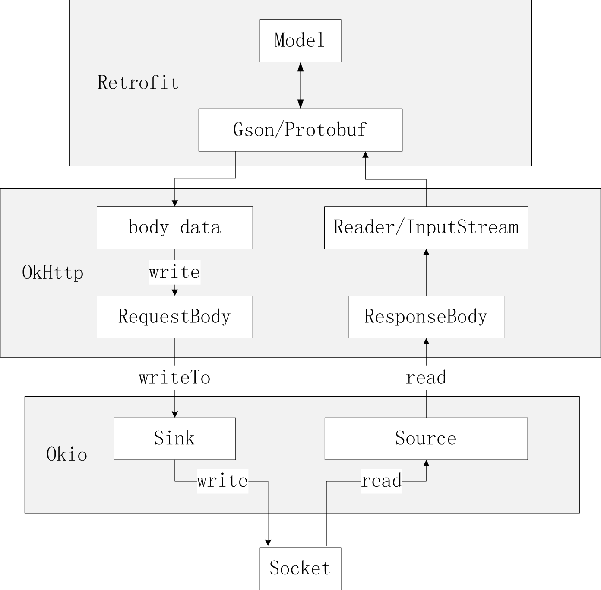

#okio

##官方描述

```
Okio 补充了 java.io 和 java.nio 的内容，使得数据访问、存储和处理更加便捷。
```
###为什么要用okio
* 低的CPU和内存消耗。**okio采用了segment的机制进行内存共享和复用**，尽可能少的去申请内存，同时也就降低了GC的频率。我们知道，过于频繁的GC会给应用程序带来性能问题。
* 在`okio`中，提供了ByteString来处理不变的byte序列，不管是从byte[]到String或是从String到byte[]，操作都非常轻快，同时还提供了如hex字符，base64等工具。而Buffer是处理可变byte序列的利器，它可以根据使用情况自动增长，在使用过程中也不用去关心position等位置的处理。
* N合一。Java的原生IO，InputStream/OutputStream, 如果你需要读取数据，如读取一个整数，一个布尔，或是一个浮点，你需要用DataInputStream来包装，如果你是作为缓存来使用，则为了高效，你需要使用BufferedOutputStream。在OKIO中BufferedSink/BufferedSource就具有以上基本所有的功能，不需要再串上一系列的装饰类。
* 提供了一系列的方便工具，如GZip的透明处理，对数据计算md5、sha1等都提供了支持，对数据校验非常方便。


##okio新增类型
###ByteString
ByteString代表一个immutable字节序列。对于字符数据来说，String是非常基础的，但在二进制数据中，则没有与之对应的存在。ByteString应运而生。它提供了一个sequence基础的操作，例如子串，判断，查找等，也能把二进制数据编解码为十六进制(hex)，base64和UTF-8格式。

###Source和Sink
Source和Sink，它们和InputStream与OutputStream类似,Source相对应于InpuStream,Sink相对应于OutputStream。
但是它们还有一些新特性:

* 超时机制，所有的流都有超时机制。
* API非常简洁，易于实现。
* `Source`和`Sink`的API非常的简洁，为了应对更复杂的需求，okio还提供了`BufferedSource`和`BufferedSink`接口，便于测试。

`Source`和`InputStream`互相操作，我们可以把它们等同对待，同理`Sink`和`OutputStream`也可以等同对待。

###Buffer
Read和Write数据缓冲区。Buffer实现了BufferSource接口和BufferSink接口,它集BufferedSource和BufferedSink的功能于一身，为我们提供了访问数据缓冲区所需要的一切的API。

Buffer 是一个可变的字节序列，就像 ArrayList 一样。我们使用时只管从它的头部读取数据，往它的尾部写入数据就行了，而无需考虑容量、大小、位置等其他因素。

**和 ByteString 一样，Buffer 的实现也使用了很多高性能的技巧。它内部使用一个双向 Segment 链表来保存数据，Segment 是对一小段字节数组的封装，保存了这个字节数组的一些访问信息，数据的移动通过 Segment 的转让完成，避免了数据拷贝的开销。而且 okio 还实现了一个 Segment 对象池，以提高我们分配和释放字节数组的效率。**


##okio的框架设计


##Retrofit，OkHttp 是如何利用 okio
在 Retrofit/OkHttp 中，IO 操作都是利用 okio 实现的，像磁盘缓存，网络 IO 等。这里我们主要看看 HTTP/1.1 网络 IO 的实现。


