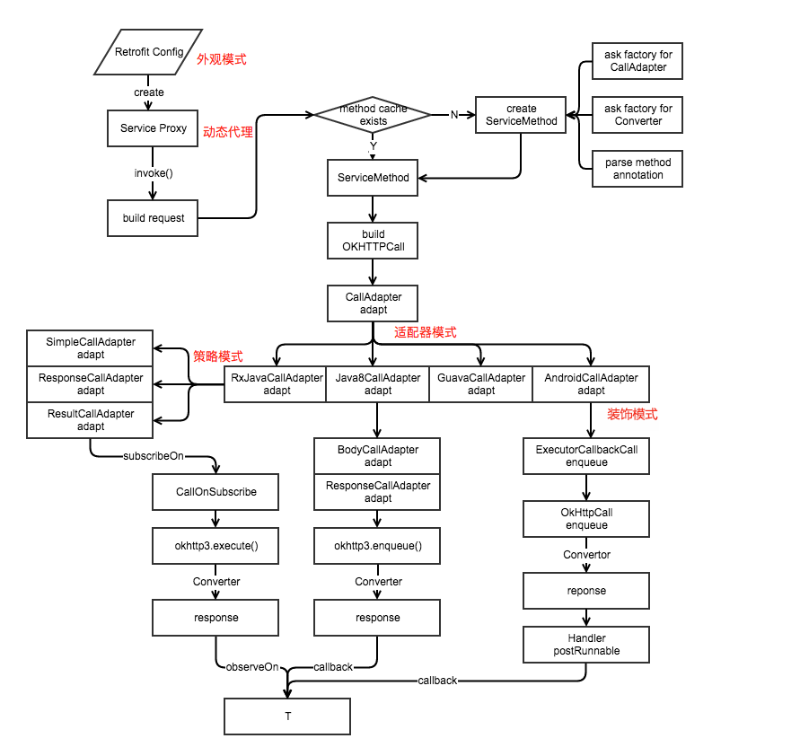

#retrofit

##官方描述
Retrofit turns your HTTP API into a Java interface.

```
public interface GitHubService {
  @GET("users/{user}/repos")
  Call<List<Repo>> listRepos(@Path("user") String user);
}
```
The Retrofit class generates an implementation of the GitHubService interface.

```
Retrofit retrofit = new Retrofit.Builder()
    .baseUrl("https://api.github.com/")
    .build();

GitHubService service = retrofit.create(GitHubService.class);
```
Each Call from the created GitHubService can make a synchronous or asynchronous HTTP request to the remote webserver.

```
Call<List<Repo>> repos = service.listRepos("octocat");
```

##Http框架


在没用Http框架的时候，我们做一次请求需要:

* build request(API参数配置)
* executor(这里可以有很多变体，比如有无队列，进出顺序，线程管理)
* parse callback(解析数据，返回T给上层)

如今的retrofit也是换汤不换药的。也是这三步。

* 通过注解配置API参数
* CallAdapter(你可以把它理解成executor)
* Converter(解析数据并转换成T)

##注解Annotation
Retrofit Annotation

```
@GET("/users/{username}")
User getUser(@Path("username") String username);
```
###概念
An annotation is a form of metadata, that can be added to Java source code. Classes, methods, variables, parameters and packages may be annotated. Annotations have no direct effect on the operation of the code they annotate.

能够添加到 Java 源代码的语法元数据。类、方法、变量、参数、包都可以被注解，可用来将信息元数据与程序元素进行关联。Annotation 中文常译为“注解”。

###作用

* 标记，用于告诉编译器一些信息

标准 Annotation，Override, Deprecated, SuppressWarnings
标准 Annotation 是指 Java 自带的几个 Annotation，上面三个分别表示重写函数，不鼓励使用(有更好方式、使用有风险或已不在维护)，忽略某项 Warning。

* 编译时动态处理，如动态生成代码

元 Annotation，@Retention, @Target, @Inherited, @Documented
元 Annotation 是指用来定义 Annotation 的 Annotation，在后面 Annotation 自定义部分会详细介绍含义


* 运行时动态处理，如得到注解信息

自定义 Annotation 表示自己根据需要定义的 Annotation，定义时需要用到上面的元 Annotation
这里是一种分类而已，也可以根据作用域分为源码时、编译时、运行时 Annotation，后面在自定义 Annotation 时会具体介绍


这里的三个作用实际对应着后面自定义 Annotation 时说的 @Retention 三种值分别表示的 Annotation

###Annotation 自定义

####调用

```
public class App {

    @MethodInfo(
        author = “trinea.cn+android@gmail.com”,
        date = "2014/02/14",
        version = 2)
    public String getAppName() {
        return "trinea";
    }
}
```
这里是调用自定义 Annotation——MethodInfo 的示例。
MethodInfo Annotation 作用为给方法添加相关信息，包括 author、date、version。

####定义

```
@Documented
@Retention(RetentionPolicy.RUNTIME)
@Target(ElementType.METHOD)
@Inherited
public @interface MethodInfo {

    String author() default "trinea@gmail.com";

    String date();

    int version() default 1;
}
```

这里是 MethodInfo 的实现部分

* 通过 @interface 定义，注解名即为自定义注解名
* 注解配置参数名为注解类的方法名，且：

	1. 所有方法没有方法体，没有参数没有修饰符，实际只允许 public & abstract 修饰符，默认为 public，不允许抛异常
	2. 方法返回值只能是基本类型，String, Class, annotation, enumeration 或者是他们的一维数组
	3. 若只有一个默认属性，可直接用 value() 函数。一个属性都没有表示该 Annotation 为 Mark Annotation

* 可以加 default 表示默认值

####元 Annotation

* @Documented 是否会保存到 Javadoc 文档中
* @Retention 保留时间，可选值 SOURCE（源码时），CLASS（编译时），RUNTIME（运行时），默认为 CLASS，SOURCE 大都为 Mark Annotation，这类 Annotation 大都用来校验，比如 Override, SuppressWarnings
* @Target 可以用来修饰哪些程序元素，如 TYPE, METHOD, CONSTRUCTOR, FIELD, PARAMETER 等，未标注则表示可修饰所有
* @Inherited 是否可以被继承，默认为 false

####Annotation 解析
#####运行时 Annotation 解析
* 运行时 Annotation 指 @Retention 为 RUNTIME 的 Annotation，可手动调用下面常用 API 解析

```
method.getAnnotation(AnnotationName.class);
method.getAnnotations();
method.isAnnotationPresent(AnnotationName.class);
```
其他 @Target 如 Field，Class 方法类似
getAnnotation(AnnotationName.class) 表示得到该 Target 某个 Annotation 的信息，因为一个 Target 可以被多个 Annotation 修饰
getAnnotations() 则表示得到该 Target 所有 Annotation
isAnnotationPresent(AnnotationName.class) 表示该 Target 是否被某个 Annotation 修饰

* 解析示例如下：

```
public static void main(String[] args) {
    try {
        Class cls = Class.forName("cn.trinea.java.test.annotation.App");
        for (Method method : cls.getMethods()) {
            MethodInfo methodInfo = method.getAnnotation(
MethodInfo.class);
            if (methodInfo != null) {
                System.out.println("method name:" + method.getName());
                System.out.println("method author:" + methodInfo.author());
                System.out.println("method version:" + methodInfo.version());
                System.out.println("method date:" + methodInfo.date());
            }
        }
    } catch (ClassNotFoundException e) {
        e.printStackTrace();
    }
}
```

以之前自定义的 MethodInfo 为例，利用 Target（这里是 Method）getAnnotation 函数得到 Annotation 信息，然后就可以调用 Annotation 的方法得到响应属性值

#####编译时 Annotation 解析

* 编译时 Annotation 指 @Retention 为 CLASS 的 Annotation，甴编译器自动解析。需要做的

 1. 自定义类集成自 AbstractProcessor
 2. 重写其中的 process 函数这块很多同学不理解，实际是编译器在编译时自动查找所有继承自 AbstractProcessor 的类，然后调用他们的 process 方法去处理
 3. 假设 MethodInfo 的 @Retention 为 CLASS，解析示例如下：

```
@SupportedAnnotationTypes({ "cn.trinea.java.test.annotation.MethodInfo" })
public class MethodInfoProcessor extends AbstractProcessor {

    @Override
    public boolean process(Set<? extends TypeElement> annotations, RoundEnvironment env) {
        HashMap<String, String> map = new HashMap<String, String>();
        for (TypeElement te : annotations) {
            for (Element element : env.getElementsAnnotatedWith(te)) {
                MethodInfo methodInfo = element.getAnnotation(MethodInfo.class);
                map.put(element.getEnclosingElement().toString(), methodInfo.author());
            }
        }
        return false;
    }
}
```

SupportedAnnotationTypes 表示这个 Processor 要处理的 Annotation 名字。
process 函数中参数 annotations 表示待处理的 Annotations，参数 env 表示当前或是之前的运行环境
process 函数返回值表示这组 annotations 是否被这个 Processor 接受，如果接受后续子的 rocessor 不会再对这个 Annotations 进行处理

###retrofit使用Annotation

* 调用

```
@GET("/users/{username}")
User getUser(@Path("username") String username);
```

* 定义

```
@Documented
@Target(METHOD)
@Retention(RUNTIME)
@RestMethod("GET")
public @interface GET {
  String value();
}
```
从定义可看出 Retrofit 的 Get Annotation 是运行时 Annotation，并且只能用于修饰 Method

* 原理

```
private void parseMethodAnnotations() {
    for (Annotation methodAnnotation : method.getAnnotations()) {
    Class<? extends Annotation> annotationType = methodAnnotation.annotationType();
    RestMethod methodInfo = null;

    for (Annotation innerAnnotation : annotationType.getAnnotations()) {
        if (RestMethod.class == innerAnnotation.annotationType()) {
            methodInfo = (RestMethod) innerAnnotation;
            break;
        }
    }
    ……
    }
}   
```

RestMethodInfo.java 的 parseMethodAnnotations 方法如上，会检查每个方法的每个 Annotation， 看是否被 RestMethod 这个 Annotation 修饰的 Annotation 修饰，这个有点绕，就是是否被 GET、DELETE、POST、PUT、HEAD、PATCH 这些 Annotation 修饰，然后得到 Annotation 信息，在对接口进行动态代理时会掉用到这些 Annotation 信息从而完成调用。

##Java 动态代理

###相关概念
####代理
在某些情况下，我们不希望或是不能直接访问对象 A，而是通过访问一个中介对象 B，由 B 去访问 A 达成目的，这种方式我们就称为代理。
这里对象 A 所属类我们称为委托类，也称为被代理类，对象 B 所属类称为代理类。
代理优点有：

* 隐藏委托类的实现
* 解耦，不改变委托类代码情况下做一些额外处理，比如添加初始判断及其他公共操作

根据程序运行前代理类是否已经存在，可以将代理分为静态代理和动态代理。

###静态代理
代理类在程序运行前已经存在的代理方式称为静态代理。
通过上面解释可以知道，由开发人员编写或是编译器生成代理类的方式都属于静态代理，如下是简单的静态代理实例：

```
class ClassA {
    public void operateMethod1() {};

    public void operateMethod2() {};

    public void operateMethod3() {};
}

public class ClassB {
    private ClassA a;

    public ClassB(ClassA a) {
        this.a = a;
    }

    public void operateMethod1() {
        a.operateMethod1();
    };

    public void operateMethod2() {
        a.operateMethod2();
    };

    // not export operateMethod3()
}
```

上面ClassA是委托类，ClassB是代理类，ClassB中的函数都是直接调用ClassA相应函数，并且隐藏了Class的operateMethod3()函数。
静态代理中代理类和委托类也常常继承同一父类或实现同一接口。

###动态代理
代理类在程序运行前不存在、运行时由程序动态生成的代理方式称为动态代理。
Java 提供了动态代理的实现方式，可以在运行时刻动态生成代理类。这种代理方式的一大好处是可以方便对代理类的函数做统一或特殊处理，如记录所有函数执行时间、所有函数执行前添加验证判断、对某个特殊函数进行特殊操作，而不用像静态代理方式那样需要修改每个函数。
静态代理比较简单，本文上面已简单介绍，下面重点介绍动态代理。

####动态代理实例
实现动态代理包括三步：

* 新建委托类；
* 实现InvocationHandler接口，这是负责连接代理类和委托类的中间类必须实现的接口；
* 通过Proxy类新建代理类对象。

下面通过实例具体介绍，假如现在我们想统计某个类所有函数的执行时间，传统的方式是在类的每个函数前打点统计，动态代理方式如下：

* 新建委托类

```
public interface Operate {

    public void operateMethod1();

    public void operateMethod2();

    public void operateMethod3();
}

public class OperateImpl implements Operate {

    @Override
    public void operateMethod1() {
        System.out.println("Invoke operateMethod1");
        sleep(110);
    }

    @Override
    public void operateMethod2() {
        System.out.println("Invoke operateMethod2");
        sleep(120);
    }

    @Override
    public void operateMethod3() {
        System.out.println("Invoke operateMethod3");
        sleep(130);
    }

    private static void sleep(long millSeconds) {
        try {
            Thread.sleep(millSeconds);
        } catch (InterruptedException e) {
            e.printStackTrace();
        }
    }
}
```

Operate是一个接口，定了了一些函数，我们要统计这些函数的执行时间。
OperateImpl是委托类，实现Operate接口。每个函数简单输出字符串，并等待一段时间。
动态代理要求委托类必须实现了某个接口，比如这里委托类OperateImpl实现了Operate，原因会后续在微博公布。

* 实现 InvocationHandler 接口
```
public class TimingInvocationHandler implements InvocationHandler {

    private Object target;

    public TimingInvocationHandler() {}

    public TimingInvocationHandler(Object target) {
        this.target = target;
    }

    @Override
    public Object invoke(Object proxy, Method method, Object[] args) throws Throwable {
        long start = System.currentTimeMillis();
        Object obj = method.invoke(target, args);
        System.out.println(method.getName() + " cost time is:" + (System.currentTimeMillis() - start));
        return obj;
    }
}
```

target属性表示委托类对象。

InvocationHandler是负责连接代理类和委托类的中间类必须实现的接口。其中只有一个

```
public Object invoke(Object proxy, Method method, Object[] args)
```
函数需要去实现，参数：

* proxy表示下面2.3 通过 Proxy.newProxyInstance() 生成的代理类对象。
* method表示代理对象被调用的函数。
* args表示代理对象被调用的函数的参数。

调用代理对象的每个函数实际最终都是调用了InvocationHandler的invoke函数。这里我们在invoke实现中添加了开始结束计时，其中还调用了委托类对象target的相应函数，这样便完成了统计执行时间的需求。
invoke函数中我们也可以通过对method做一些判断，从而对某些函数特殊处理。

* 通过 Proxy 类静态函数生成代理对象

```
public class Main {
    public static void main(String[] args) {
        // create proxy instance
        TimingInvocationHandler timingInvocationHandler = new TimingInvocationHandler(new OperateImpl());
        Operate operate = (Operate)(Proxy.newProxyInstance(Operate.class.getClassLoader(), new Class[] {Operate.class},
                timingInvocationHandler));

        // call method of proxy instance
        operate.operateMethod1();
        System.out.println();
        operate.operateMethod2();
        System.out.println();
        operate.operateMethod3();
    }
}
```
这里我们先将委托类对象new OperateImpl()作为TimingInvocationHandler构造函数入参创建timingInvocationHandler对象；

然后通过Proxy.newProxyInstance(…)函数新建了一个代理对象，实际代理类就是在这时候动态生成的。我们调用该代理对象的函数就会调用到timingInvocationHandler的invoke函数(是不是有点类似静态代理)，而invoke函数实现中调用委托类对象new OperateImpl()相应的 method(是不是有点类似静态代理)。

```
public static Object newProxyInstance(ClassLoader loader, Class<?>[] interfaces, InvocationHandler h)
```

`loader`表示类加载器

`interfaces`表示委托类的接口，生成代理类时需要实现这些接口

`h`是`InvocationHandler`实现类对象，负责连接代理类和委托类的中间类

我们可以这样理解，如上的动态代理实现实际是双层的静态代理，开发者提供了委托类 B，程序动态生成了代理类 A。开发者还需要提供一个实现了InvocationHandler的子类 C，子类 C 连接代理类 A 和委托类 B，它是代理类 A 的委托类，委托类 B 的代理类。用户直接调用代理类 A 的对象，A 将调用转发给委托类 C，委托类 C 再将调用转发给它的委托类 B。

###动态代理的过程
动态代理借助java的反射特性，通过易写的接口与注解，帮助用户自动生成实际的对象，接口中方法真正的调用交给InvocationHandler。

| Input        | interface	    |
| ------------- |:-------------:|
| Proxy.newProxyInstance|对接口进行包装，内部方法由handler委任|
|Output|interface(with InvocationHandler)|
####生成前

```
public interface GitHub {
  @GET("/repos/{owner}/{repo}/contributors") Call<List<Contributor>> contributors(
      @Path("owner") String owner, @Path("repo") String repo);
}

Call<List<Contributor>> call = github.contributors("square", "retrofit");
```

####代理生成中

```
Proxy.newProxyInstance(service.getClassLoader(), new Class<?>[] { service },
  new InvocationHandler() {
    private final Platform platform = Platform.get();

    @Override public Object invoke(Object proxy, Method method, Object... args)
         .....
         //开始处理注解并拼装成OkHttp的call
      return loadMethodHandler(method).invoke(args);
    }
  });
}
```
####生成后

```
public final class Github extends Proxy implements SimpleService.GitHub {
  private static Method m0;//自带的hashCode方法
  private static Method m1;//自带的equals方法
  private static Method m2;//自带的toString
  private static Method m3;//真正的接口中的方法

  static {
    try {
    //省略Object自带方法的初始化
      m0,m1,m2 = ...
      //接口中真正的方法
      m3 = Class.forName("com.example.retrofit.SimpleService$GitHub")
          .getMethod("contributors",
              new Class[] { Class.forName("java.lang.String"), Class.forName("java.lang.String") });
    } catch (Throwable e) {
      throw new NoSuchMethodError(e.getMessage());
    } catch (Throwable e2) {
      throw new NoClassDefFoundError(e2.getMessage());
    }
  }

  public Github(InvocationHandler invocationHandler) {
    super(invocationHandler);
  }

    //这里的参数实际上就是用户输入的"square", "retrofit"
  public final Call contributors(String str, String str2) {
    RuntimeException e;
    try {
    //this.h是InvocationHandler，也就是上文重写的Handler
    //可以看出实际调用的是handler的`invoke`方法
      return (Call) this.h.invoke(this, m3, new Object[] { str, str2 });
    } catch (Throwable e) {
      throw e;
    } 
  }

  ....Object自带方法的代理...
}
```

####动态代理的原理
代理生成的过程使用了sun包中的闭源方法，反编译大致看了一下，先把接口通过native方法ProxyGenerator.generateProxyClass()根据Class文件的规范拼装生成了byte[]字节码，这个方法是在jvm（或者说art）的runtime中作为cpp编写的，详见[这里](https://android.googlesource.com/platform/art/+/master/runtime/native/java_lang_reflect_Proxy.cc)。接着用native方法defineClass0()转换为JVM中的Class结构体，最后通过class加载与连接，最后创建Class，然后通过class.newInstance进行对象的实例化。可以看出动态代理本质上是生成大量样板代码的过程。相比于静态代理，动态代理可以减少编写代理类（比如XXXImpl）的工作量。

##设计思路



##Refrence
* [注解 Annotation](http://a.codekk.com/detail/Android/Trinea/公共技术点之%20Java%20注解%20Annotation)
* [Java 动态代理](http://a.codekk.com/detail/Android/Caij/公共技术点之%20Java%20动态代理)
* [Retrofit2源码分析[动态代理]](http://www.jianshu.com/p/a56c61da55dd)
